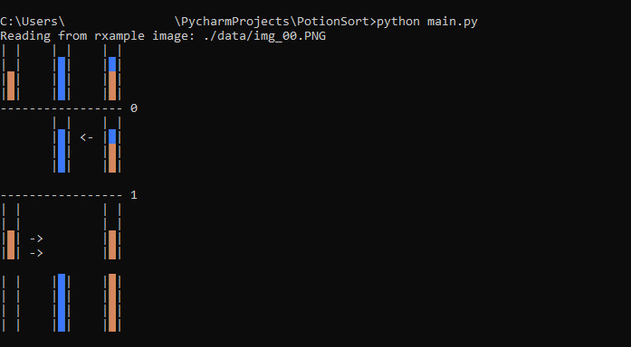

# PotionSort

A silly python program to that solves puzzles for the game mobile [SortPuz](https://apps.apple.com/us/app/sortpuz-water-puzzles-games/id1560298214).

It can take a screenshot of a level as input, analyze the displayed puzzle and present a step by step solution as a command line output.




## Installation

Install the packets listed in "requirements.txt"

## Usage

Run `python3 main.py <file-path>` in a command line interface that supports colored text.

`<file-path>` - path to a screenshot of a level or a text file with the puzzle in text format.

#### Puzzle text format

Mainly for debuging reasons a puzzle can also be input as a text file with a format like this:

```
lobb
oboo
blll
####
####
```

Each line represents a potion flask, with each character representing the color of a fluid (ordered from bottom to top of the flask)

The encoding of the fluids is:

```
#: free space in a flask
r: red
g: green
b: blue
y: yellow
o: orange
p: purple
l: lime
s: sky blue
w: brown 
e: grey
k: pink
i: beige
```